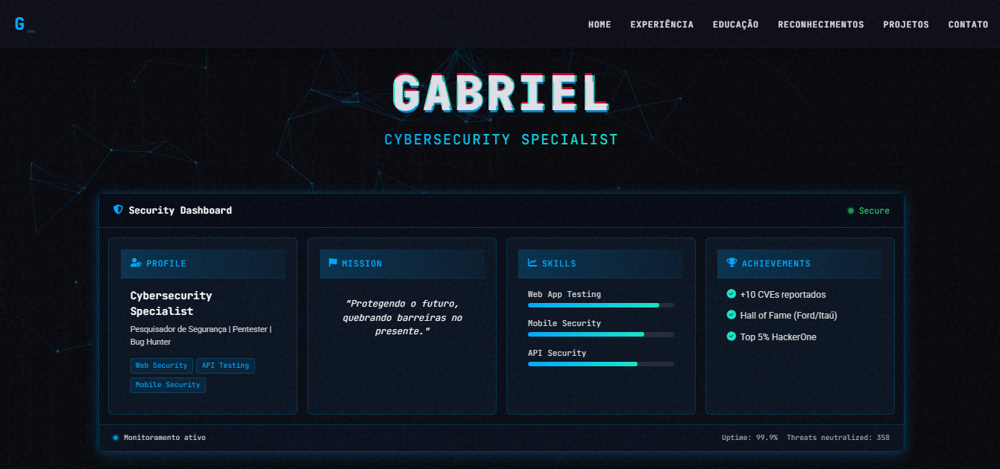

# 🔐 CyberPortfolio | Portfólio de Segurança da Informação

<div align="center">


</div>

## 📋 Visão Geral

Um portfólio profissional moderno com tema futurista para especialistas em **Cybersecurity**, **Pentesting** e **Bug Bounty**. Projetado com interface que emula sistemas de segurança avançados para exibir suas habilidades e conquistas.

<div align="center">



</div>

## ✨ Características

- 🌙 Design futurista com tema escuro (dark theme)
- 🖥️ Dashboard de segurança interativo com visualização de dados
- 📱 Layout totalmente responsivo para todos os dispositivos
- 🎬 Animações e efeitos visuais de alta qualidade
- 🛡️ Seções específicas para experiência em segurança e reconhecimentos
- 🌐 Integração com particles.js para efeitos de background
- 🔄 Navegação suave com animações de transição

## 🗂️ Estrutura do Projeto

```
portfolio/
│
├── index.html               # Página principal
│
├── css/
│   ├── reset.css            # Reset de estilos
│   ├── main.css             # Estilos principais
│   ├── animations.css       # Animações e efeitos visuais
│   └── responsive.css       # Adaptações para dispositivos
│
├── js/
│   ├── main.js              # Funcionalidades principais
│   └── animations.js        # Animações avançadas
│
├── images/                  # Imagens e badges
│   ├── placeholder-ford.png
│   ├── placeholder-itau.png
│   └── preview.png
│
└── assets/                  # Outros recursos (favicon, etc)
    └── favicon.ico
```

## 🛠️ Personalização

### Informações Pessoais

Para personalizar o portfólio com suas informações:

1. **Edite o arquivo `index.html` para atualizar**:

   - Nome e título profissional
   - Experiências e timeline
   - Certificações e formação acadêmica
   - Projetos e trabalhos realizados
   - Reconhecimentos e Hall of Fame
   - Links de contato e redes sociais

2. **Substitua as imagens placeholder**:

   Substitua os arquivos em `images/` por suas próprias imagens:

   - Badges de Hall of Fame
   - Screenshots de projetos
   - Imagem de preview do site

### 🎨 Personalização Visual

Para ajustar as cores e estilo:

1. **Edite as variáveis CSS em `css/main.css`**:

   ```css
   :root {
     --color-background: #0a0a0f; /* Cor de fundo principal */
     --color-surface: #15151e; /* Cor de elementos de superfície */
     --color-primary: #00a8ff; /* Cor primária (azul cyber) */
     --color-secondary: #18e6c7; /* Cor secundária (aqua) */
     --color-accent: #ff003c; /* Cor de destaque (vermelho) */
     --color-text: #e0e0e8; /* Cor de texto principal */
     --color-text-muted: #8888a2; /* Cor de texto secundário */
   }
   ```

2. **Para modificar animações**:

   Ajuste o arquivo `css/animations.css` para personalizar as transições e efeitos.

### 🖥️ Dashboard de Segurança

O dashboard de segurança é um componente visual inteligente e dinâmico.  Para personalizá-lo:

1. **Edite as métricas e estatísticas**:

   - Modifique os dados de habilidades no dashboard
   - Atualize os achievements mostrados
   - Personalize a "missão" exibida

2. **Ajuste os elementos visuais**:
   - Modifique os ícones (usando Font Awesome)
   - Altere as cores dos indicadores de progresso
   - Ajuste os efeitos de pulsação e glow

## 🚀 Como Usar

1. Clone ou baixe este repositório:

   ```bash
   git clone https://github.com/xOryus/Portfolio.git
   ```

2. Personalize os arquivos conforme suas necessidades

3. Hospede em qualquer servidor web ou plataforma como:
   - GitHub Pages
   - Netlify
   - Vercel
   - Firebase Hosting

## 💻 Tecnologias Utilizadas

- **Front-end**: HTML5, CSS3, JavaScript (ES6+)
- **Bibliotecas**: Particles.js para efeito de partículas
- **Ícones**: Font Awesome 6.5.1
- **Fontes**: JetBrains Mono, Roboto

## 📱 Compatibilidade

O portfólio é totalmente responsivo e compatível com:

- ✅ Chrome, Firefox, Safari, Edge (versões modernas)
- ✅ Dispositivos móveis e tablets (iOS e Android)
- ✅ Diferentes tamanhos de tela e orientações

## 📊 Demonstração de Recursos

| Recurso                      | Descrição                                                       |
| ---------------------------- | --------------------------------------------------------------- |
| **Dashboard de Segurança**   | Interface interativa que exibe habilidades, conquistas e status |
| **Linha do Tempo**           | Visualização estilizada da sua experiência profissional         |
| **Badges de Reconhecimento** | Exibição visual de suas conquistas e Hall of Fame               |
| **Grid de Projetos**         | Layout moderno para exibir seus projetos de segurança           |
| **Contadores Animados**      | Estatísticas com animação de contagem para engajamento visual   |

## 📜 Licença

Este projeto está disponível como código aberto sob a [licença MIT](LICENSE).

---

<div align="center">

**🔐 Desenvolvido por [Gabriel](https://github.com/xOryus) | Cybersecurity Specialist 🔐**

</div>
